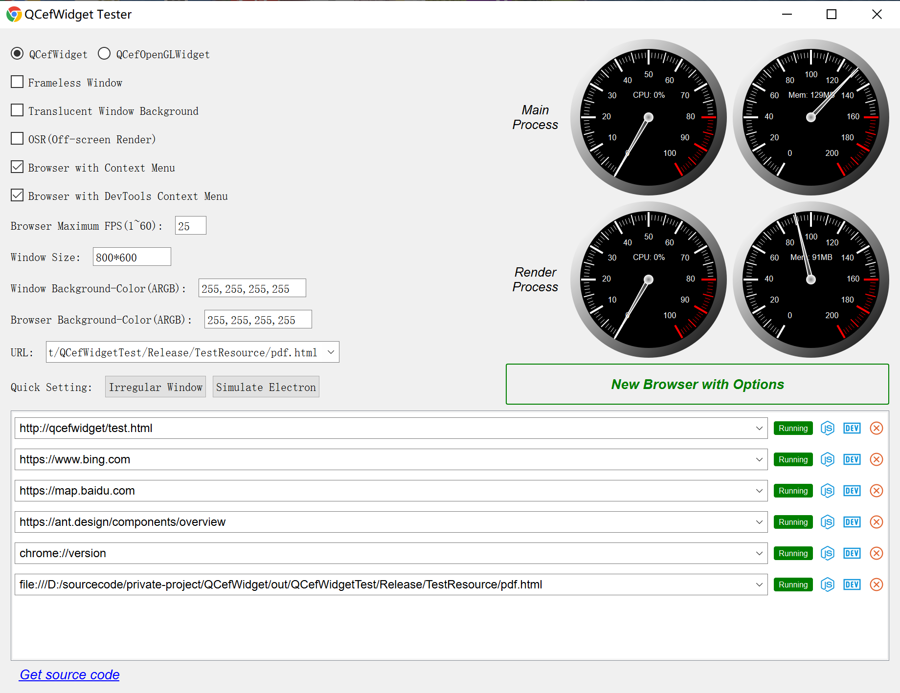
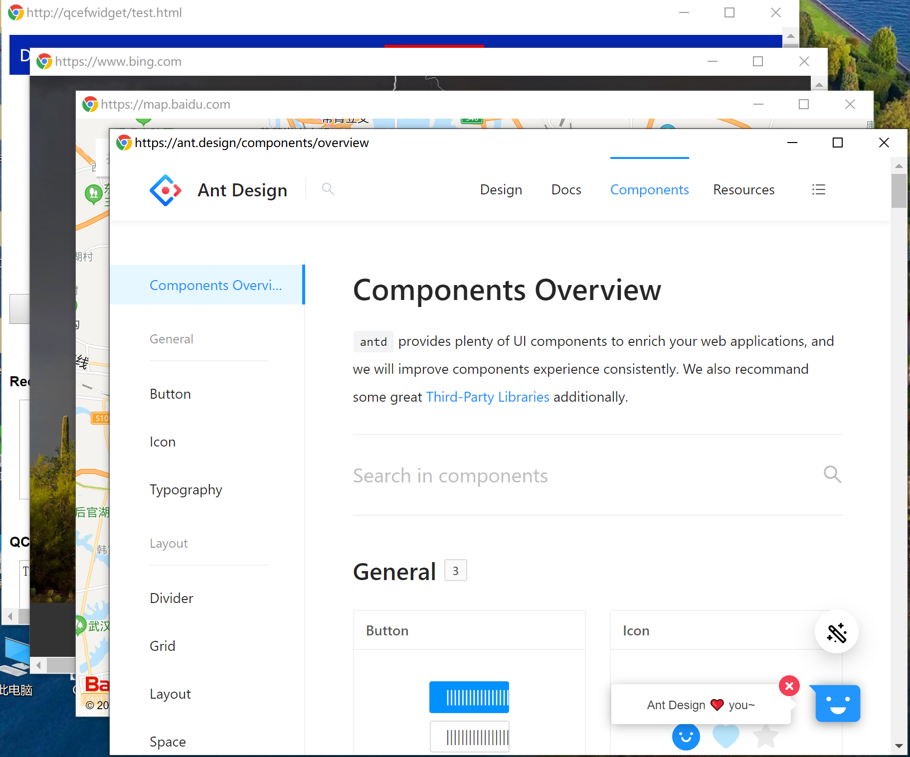

[ >>> 中文版](README_ch.md)

# 1. QCefWidget

The QCefWidget project provide a widget that is used to view webpage. 

Support:

✅ Supports both CEF OSR and non-OSR mode;

✅ Show background transparent webpage in irregularity window;

✅ Javascript and Qt interaction;

✅ OpenGL graphics acceleration;

✅ Third-party input method software;

✅ Perfect exit app without any CEF assert/exception in debug/release mode;

✅ Separate CEF rendering process and plugin process;

✅ Support Adobe Flash without any warnning, eg "Control-click to run Adobe Flash Player".

✅ Drag/Drop frameless window like Electron throught setting CSS property.

---


# 2. Build Instruction
- Download and install [CMake](https://cmake.org/).
- Download and install Qt SDK from [Qt Downloads](https://download.qt.io/archive/qt/).
- Download CEF binary distribution [Chromium Embedded Framework (CEF) Automated Builds](https://cef-builds.spotifycdn.com/index.html) and extract it to ***dep***   (Optional) directory.
  For example:
	```
	root
	├─dep
	│  └─cef_binary_80.1.15+g7b802c9+chromium-80.0.3987.163_windows32
	├─src
	└─test
	```
- Update the [config.cmake](config.cmake) to set the required build configurations.
  **QCefWidget SDK Version**
	```bash
	SET(QCEF_VERSION_MAJOR 1)
	SET(QCEF_VERSION_MINOR 0)
	SET(QCEF_VERSION_PATCH 3)
	```

  **CEF SDK** 
  Special CEF SDK folder (**Important**):
	```bash
	set(CEF_SDK_DIR  "${CMAKE_CURRENT_SOURCE_DIR}/dep/cef_binary_76.1.13+gf19c584+chromium-76.0.3809.132_windows32")
	```

  Special CEF SDK version (**Important**):
	```bash
	SET(CEF_VERSION_MAJOR 76)
	SET(CEF_VERSION_MINOR 1)
	SET(CEF_VERSION_PATCH 13)
	```

CEF has two version format:
- 3.3683.1920.g9f41a27 / Chromium **73.0.3683**.75
- **73.1.3**+g46cf800+chromium-73.0.3683.75 / Chromium 73.0.3683.75

For CEF_VERSION_XXX macro, the first format type borrows the first 3 paragraphs of the Chromium's version number, the second format can use CEF's version directly.

QCefWidget library will use these version macro to support different CEF version, such as:
``` c++
#if CEF_VERSION_MAJOR == 72
  virtual bool
  OnProcessMessageReceived(CefRefPtr<CefBrowser> browser,
			   CefProcessId source_process,
			   CefRefPtr<CefProcessMessage> message) override;
#elif CEF_VERSION_MAJOR == 76 || CEF_VERSION_MAJOR == 89
  bool OnProcessMessageReceived(CefRefPtr<CefBrowser> browser,
				CefRefPtr<CefFrame> frame,
				CefProcessId source_process,
				CefRefPtr<CefProcessMessage> message) override;
#endif
```


- Using CMake to build the project
  For example:
	```bash
	mkdir build && cd build
	cmake .. && cmake --build .
	```
# 3. Test
QCefWidget has been tested with follow Qt and CEF version:

|Qt Version|CEF Version|Pass|
|---|---|---|
|5.12.10|3.3626.1895|✅|
|5.12.10|76.1.13|✅|
|5.12.10|89.0.18|✅|
|5.14.2|3.3626.1895|✅|

# 4. Usage
QCefWidgetTest is a perfect demo about how to use QCefWidget in `test` folder.




