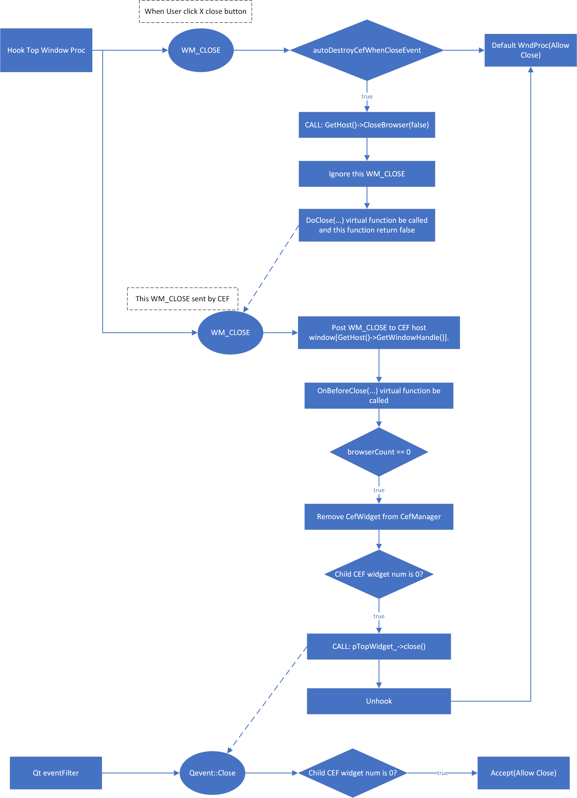

[ >>> English Version](README.md)

# 一、QCefWidget
`QCefWidget`项目提供一个Widget来显示网页.

支持：

✅ 同时支持CEF OSR和非OSR模式;

✅ 在不规则窗体中显示背景透明的网页;

✅ Javascript与Qt交互;

✅ OpenGL图形加速;

✅ 第三方输入法;

✅ 在Debug/Release模式下完美退出程序，无任何CEF断言;

✅ 独立的CEF渲染进程和插件进程;

✅ 支持Adobe Flash, 没有任何警告，如"Control-click to run Adobe Flash Player".

✅ 只需要设置CSS属性，就可以实现像Electron一样拖拽无边框窗体.

---


# 二、快速构建

## 2.1 CMake

下载安装[CMake](https://cmake.org/).

## 2.2 Qt SDK

从[Qt Downloads](https://download.qt.io/archive/qt/)下载安装Qt SDK.

## 2.3 CEF预编译文件

从[Chromium Embedded Framework (CEF) Automated Builds](https://cef-builds.spotifycdn.com/index.html)下载CEF预编译版本，并解压到 ***dep*** 目录（非必需的）。

目录结构类似:
```txt
root
├─dep
│  └─cef_binary_80.1.15+g7b802c9+chromium-80.0.3987.163_windows32
├─src
└─test
```
	
## 2.4 config.cmake
在[config.cmake](config.cmake)文件中配置必要的参数.
### 2.4.1 QCefWidget版本
```bash
SET(QCEF_VERSION_MAJOR 1)
SET(QCEF_VERSION_MINOR 0)
SET(QCEF_VERSION_PATCH 3)
```

### 2.4.2 CEF SDK

指定CEF SDK目录：

```bash
set(CEF_SDK_DIR "${CMAKE_CURRENT_SOURCE_DIR}/dep/cef_binary_76.1.13+gf19c584+chromium-76.0.3809.132_windows32")
```

指定CEF SDK的版本信息：

```bash
SET(CEF_VERSION_MAJOR 76)
SET(CEF_VERSION_MINOR 1)
SET(CEF_VERSION_PATCH 13)
```
	
CEF有两种版本格式，例如：
- 3.3683.1920.g9f41a27 / Chromium **73.0.3683**.75
- **73.1.3**+g46cf800+chromium-73.0.3683.75 / Chromium 73.0.3683.75

在指定CEF_VERSION_XXX宏时，第一种借用Chromium版本号的前3段（加粗部分），第二种可以直接使用CEF的版本（加粗部分）。

在代码中将会使用这些预定义宏进行CEF版本适配，如：

```c++
#if CEF_VERSION_MAJOR == 72
	virtual bool
	OnProcessMessageReceived(CefRefPtr<CefBrowser> browser,
							CefProcessId source_process,
							CefRefPtr<CefProcessMessage> message) override;
#elif CEF_VERSION_MAJOR == 76 || CEF_VERSION_MAJOR == 89
	bool OnProcessMessageReceived(CefRefPtr<CefBrowser> browser,
								CefRefPtr<CefFrame> frame,
								CefProcessId source_process,
								CefRefPtr<CefProcessMessage> message) override;
#endif
```

## 2.5 使用`CMake`命令生成项目文件并构建

``` bash
mkdir build && cd build
cmake .. && cmake --build .
```

# 三、测试
已经针对下面版本的Qt和CEF组合进行了测试：

|Qt版本|CEF版本|是否通过|
|---|---|---|
|5.12.10|3.3626.1895|✅|
|5.12.10|76.1.13|✅|
|5.12.10|89.0.18|✅|
|5.14.2|3.3626.1895|✅|
|5.15.2|74.1.19|✅|
|5.15.2|76.1.13|✅|
|5.15.2|89.0.18|✅|

理论上，也支持其他Qt5+和CEF版本。

# 四、用法
test目录中的QCefWidgetTest是一个示例程序，演示了如何使用QCefWidget。


# 五、代码结构
下图是用户点击窗口右上角关闭按钮（或者向窗口发送WM_CLOSE消息）后，QCefWidget控件和窗口销毁的过程：



> 通过`QWidget::close()`方法关闭窗口时，QCefWidget控件和窗口销毁的过程与上图稍有不同，但大体类似。
